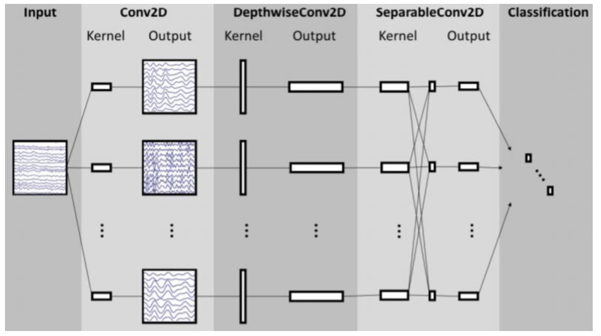
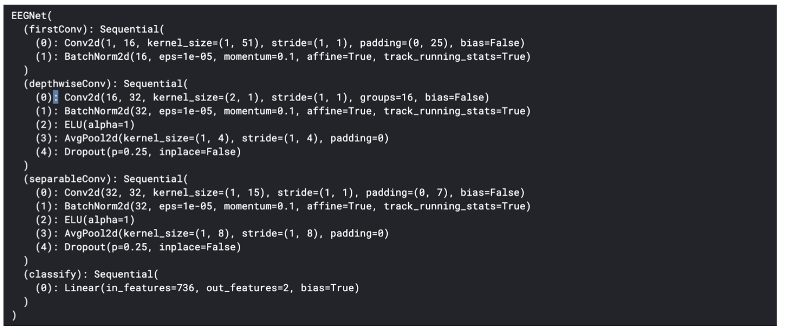
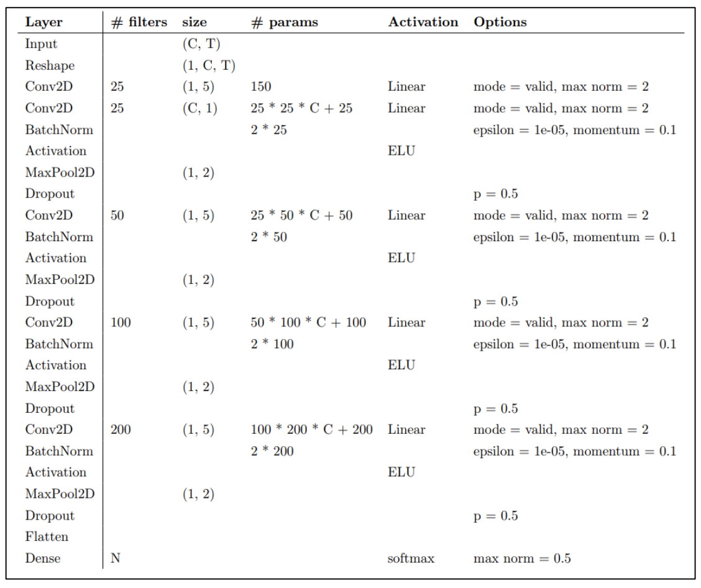
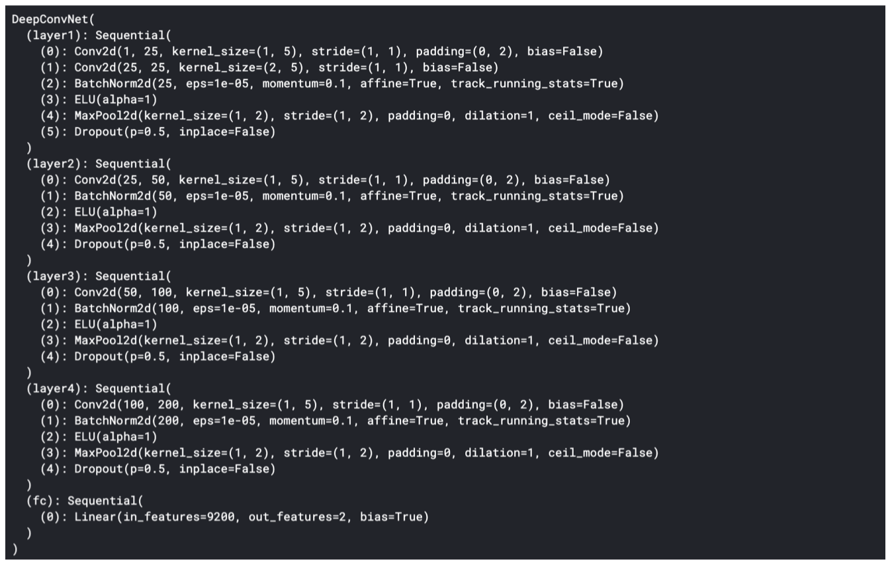
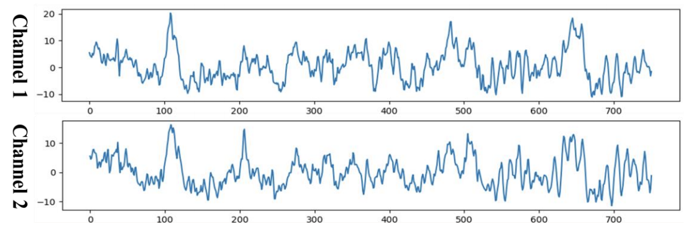
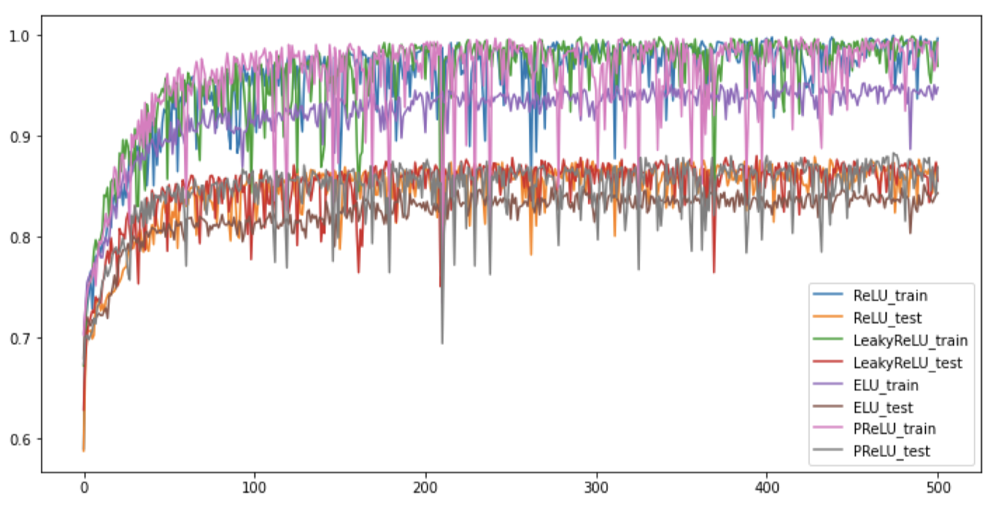
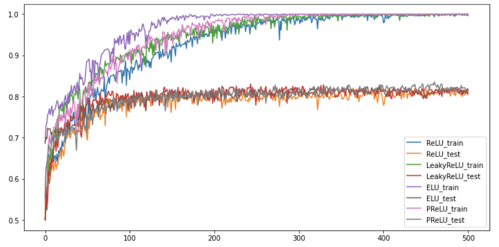

# EEG-Classification
In this implementation, I use Pytorch & NUMPY ot building a simple EEG classification models
which are EEGNet, DeepConvNet [1] with BCI competition dataset.

### Model Architecture
#### EEGNet
Overall visualization of the EEGNet architecture

Reference: Depthwise Separable Convolution
https://towardsdatascience.com/a-basic-introduction-to-separableconvolutionsb99ec3102728

#### DeepConvNet
Overall visualization of the EEGNet architecture

### Prepare Data
The training data and testing data have been preprocessed and named
[S4b_train.npz, X11b_train.npz] and [S4b_test.npz, X11b_test.npz]
respectively. Please download the preprocessed data and put it in the same
folder. To read the preprocessed data, refer to the “dataloader.py”.

### Result Comparison
#### EEGNet

#### DeepConvNet
